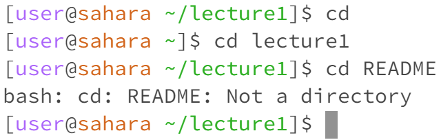
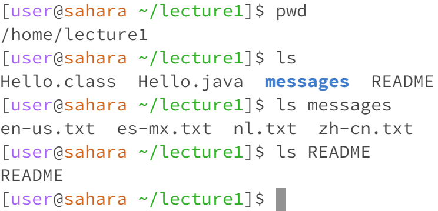
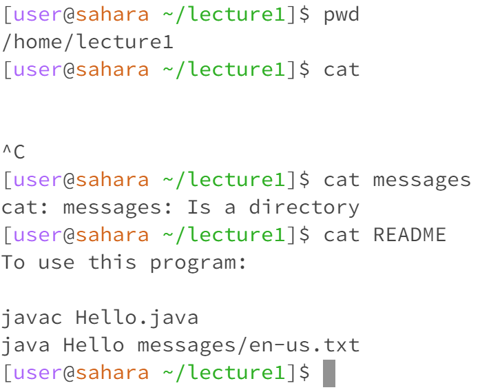

# Lab Report 1

## `cd` command testing:

The working directory was `/home/lecture1`
Without an argument, the working directory changed to `/home` (the default directory).
With a directory as an argument, the working directory changes to the given path.
With a file as an argument, it produced an error because `cd` changes the current directory which cannot be a file.

## `ls` command testing:

The working directory was `/home/lecture1`
Without an argument, a list of the filenames in the directory was output.
With a directory as an argument, a list of the filesnames in the given directory was output.
With a file as an argument, the name of the file was output.
No errors were output.

## `cat` command testing:

The working directory was `/home/lecture1`
Without an argument the terminal got stuck in an infinite loop while waiting for a correct input.
Exiting the input required using ctrl+c to exit the command.
While not an error, one would have been useful with incorrect input.
With a directory as an argument, an error was output because `cat` cannot read information from a directory.
With a file as an argument, the contents of the file was output.
