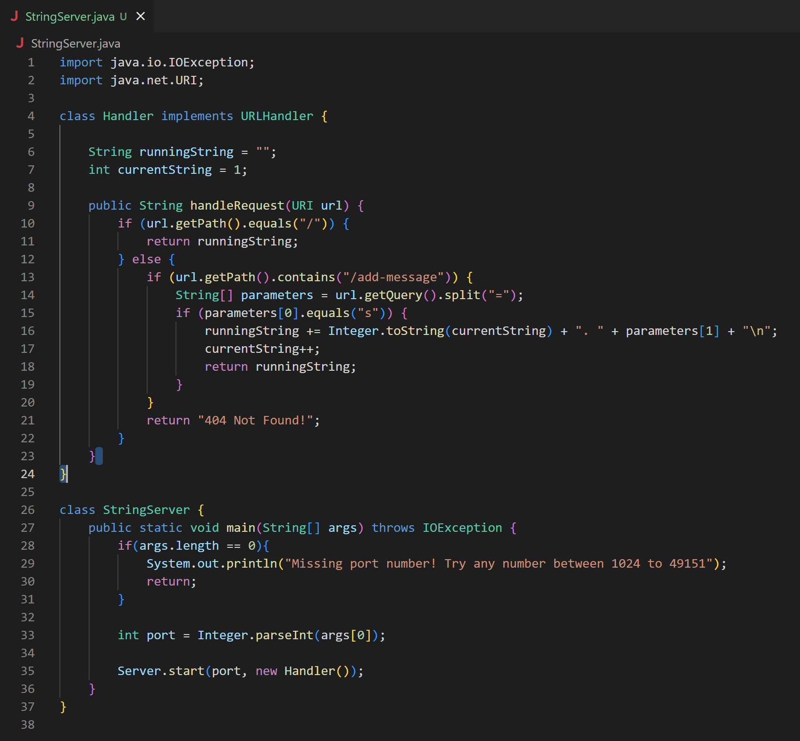
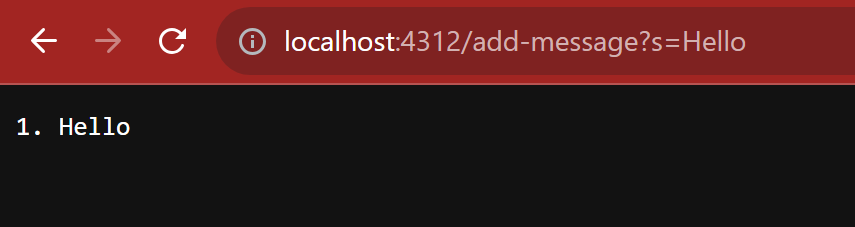
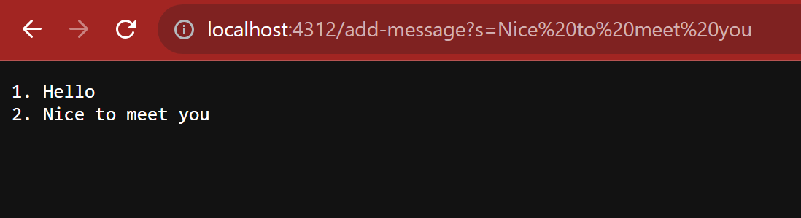
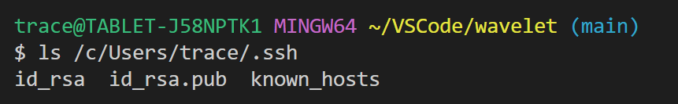
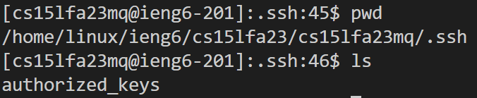
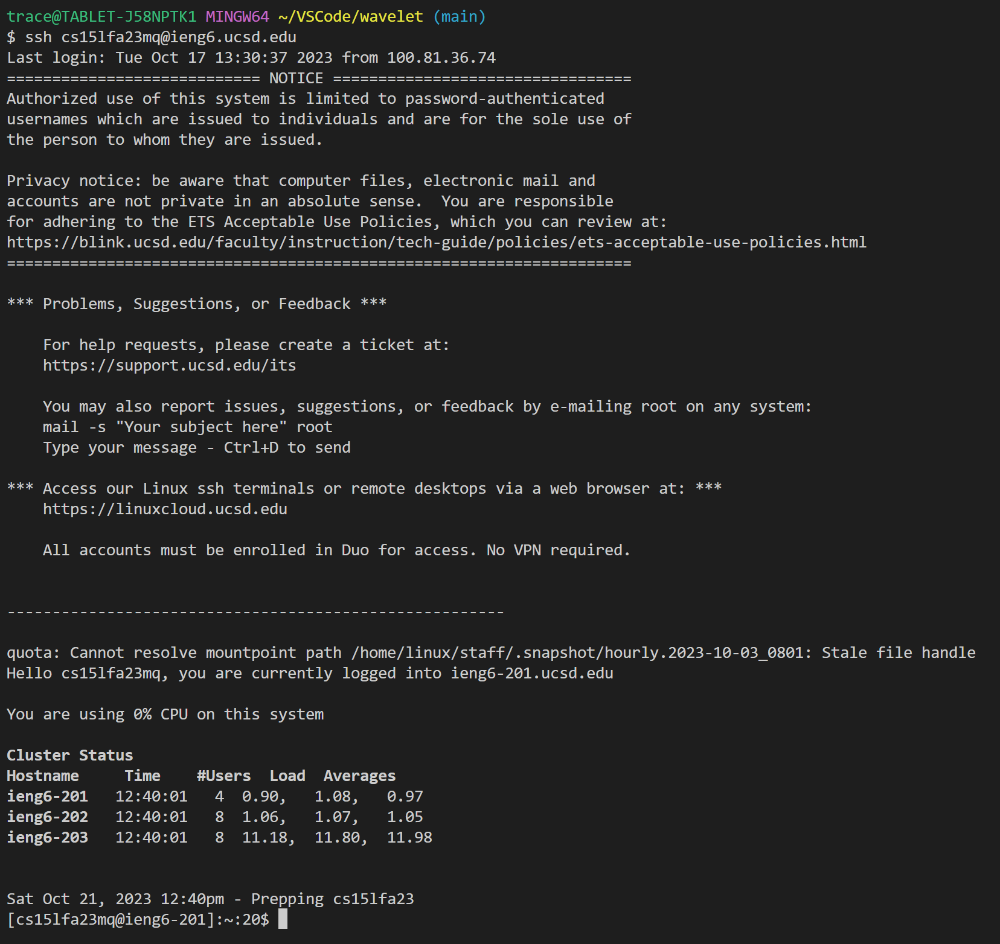

# Lab Report 2

## String Server Code

### First URL Test

In my code, the `handleRequest(URI)` method is called, with the URL entered in the browser being passed as the argument. There are 2 relevant fields within the class: `runningString`, which is a string that stores the list of strings added via the URL path; and `currentString`, which is an integer that stores the number of strings currently stored in `runningString` for formatting purposes. When the URL in the screenshot is entered, both fields will be modified. First, the `currentString` value will be added to `runningString` along with a ". " and then the string entered in the URL following the '=' in the querey in the URL, and finally a newline character. This allows for the formatting needed to create a 'list' within a single string. The `currentString` value will also be incremented in order to make sure the numbered list is in the correct order.

### Second URL Test

The process is almost exactly the same as the previous image, however there are already some values stored in the relevant fields from the previous input. The method called will be the same, however now the `currentString` value will be 2 instead of 1, and (potentially) a different string will be added to `runningString`. This will create a numbered list that will be output to the browser window after adding the string.

## Private Key Path

## Public Key Path

## No-Password Login

## What I learned in Coding School is...

So far the main thing I have learned in 15L has been how to use ssh to access remote servers. I have never used ssh before this class, so this is all completely new to me. I barely used terminal before either, so it is a very new experience learning the process for all this. However I see how useful learning how to remotely access servers and computers is when we are likely to be separated from the physical device often, even in the same building much of the time. Having to use terminal without the help of an active directory or other tools is a challange, and it's good I'm learning sooner.
