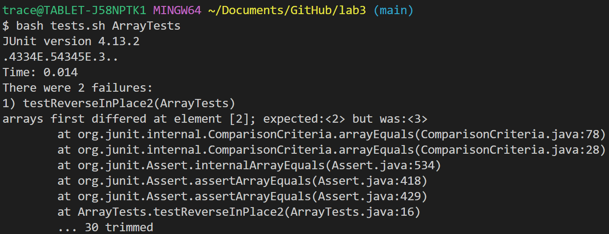

# Lab Report 3

## Bugs

### The buggy code before being fixed:
```cpp
  static void reverseInPlace(int[] arr) {
    for(int i = 0; i < arr.length; i += 1) {
      arr[i] = arr[arr.length - i - 1];
    }
  }
```
### The failure-inducing input for the JUnit test:
```cpp
	@Test 
	public void testReverseInPlace2() {
    int[] input1 = { 1, 2, 3, 4 };
    ArrayExamples.reverseInPlace(input1);
    assertArrayEquals(new int[]{ 4, 3, 2, 1 }, input1);
	}
```
### The non-failure-inducing input for the JUnit test:
```cpp
	@Test 
	public void testReverseInPlace() {
    int[] input1 = { 3 };
    ArrayExamples.reverseInPlace(input1);
    assertArrayEquals(new int[]{ 3 }, input1);
	}
```
### Image of JUnit output:


This JUnit test fails with the output "arrays first differed at element [2]; expected:<2> but was:<3>". Printing the array to console after reversing it shows that the array is actually being output as [4,3,3,4]. (The first dot in the JUnit output is `testReverseInPlace`, which passes, the `4334` is my debug output, and the E is `testReverseInPlace2`, which is the one that fails.) This bug is due to a few issues with the code, the first being that `arr[i] = arr[arr.length - i - 1];` overwriting the first half of the array with the second half, but doesn't write the first half to the second half. This is solved by using a temporary variable, `int temp = 0`, to hold the elements from the front to store in the back after having been overwritten (the first and last lines of the for loop). However, a new bug will arise from this fix, because the array is iterating over the whole array, so it will basically 'un-reverse' itself when it iterates through the second half. The fix for this is to have the for loop stop halfway through the array using `i < arr.length / 2`.

### The fixed code:
```cpp
  static void reverseInPlace(int[] arr) {
    int temp = 0;
    for(int i = 0; i < arr.length / 2; i += 1) {
      temp = arr[i];
      arr[i] = arr[arr.length - i - 1];
      arr[arr.length - i - 1] = temp;
    }
  }
```


## Researching Commands

### Option 1: `-size n`

The `find -size n` option allows for the user to search the file directory for files that are less than (-n), equal to (n), or greater than (+n) a given file size. The file path is returned if the size in bytes, divided by 512, is (+/-)n. This essentially saying that n=1 is equal to a half kilobyte.

Source: Using `man find`, I read the different options and experimented with their uses in VS Code.

#### Example 1:

The `-size` option can be used to find files above a certain size, if for example you wanted to find overly large files that may be cluttering your system. In this example I search for all files greater than n=500, which is all flies above 250KB.

```console
$ find ./technical -size +500

./technical/911report/chapter-13.4.txt
./technical/911report/chapter-13.5.txt
./technical/911report/chapter-3.txt
./technical/government/Gen_Account_Office/d01591sp.txt
./technical/government/Gen_Account_Office/Statements_Feb28-1997_volume.txt
```

#### Example 2:

I discovered an interesting use for `-size` while experimenting with the file sizes. It can be used to find any empty files in a directory. Since the option rounds up to the nearest integer, any file with any file size will automatically be considered to be 1 or greater. So by using n=0, we can find all files that have 0 file size, or are empty. In my example, I placed a file inside `/government` called `testing.txt` that contains no text. However, as you can see I encountered an interesting issue: directories are considered to have no file size. This can be solved by adding the `-type f` operation to the commmand to search for files that are size 0.

```console
$ fine ./technical -size 0

./technical
./technical/911report
./technical/biomed
./technical/government
./technical/government/About_LSC
./technical/government/Alcohol_Problems
./technical/government/Env_Prot_Agen
./technical/government/Gen_Account_Office
./technical/government/Media
./technical/government/Post_Rate_Comm
./technical/government/testing.txt
./technical/plos


$ find ./technical -size 0 -type f

./technical/government/testing.txt
```

### Option 2: `-mtime n`

The `find -mtime n` option can be used to see which files have been modified in the last n days. This works by taking the time between the file's last modification and the time the command was run, in seconds, and divies by 86,400, which is the number of seconds in a day.

Source: Using `man find`, I read the different options and experimented with their uses in VS Code.

#### Example 1:

The `-mtime` option can be useful for finding files that have been recently modified, incase you accidentally modified a file and you weren't sure which one, or possibly to see if anyone else might have modified a file recently. In my example, n=-1, so the command searches for any files modified in the last day. Since I just created the file `testing.txt` today, the command returns that file path, as well as the directory since it was technically modified as well.

```console
$find ./technical -mtime -1

./technical/government
./technical/government/testing.txt
```

#### Example 2:

Another use for the `-mtime` can be to see if any files were modified on a specific date. This can be useful to find files you might have worked on a specific date, or possibly if someone might have modified files on a date that may have had access to your system. In my example, I search for files modified 5 days ago, which is the day I made the directory. All the files are printed, so I will only paste a few lines of the output.

```console
$fine ./technical -mtime 5

...<Many more files>...
./technical/plos/pmed.0020268.txt
./technical/plos/pmed.0020272.txt
./technical/plos/pmed.0020273.txt
./technical/plos/pmed.0020274.txt
./technical/plos/pmed.0020275.txt
./technical/plos/pmed.0020278.txt
./technical/plos/pmed.0020281.txt
```

### Option 3: `-prune`

The `find -prune` option can be used to exclude certain directories from a search. The command will not traverse the given directory, skipping over it as it searches the rest of the files.

Source: Using `man find`, I read the different options and experimented with their uses in VS Code.

#### Example 1:

In this example, `-print` is used to tell the command to print the files found to the console. This is usually implied by default, but is needed in this case. `-name plos` tells the `-prune` option to ignore directories named plos, and therefore they will not be printed to console. As before, this will print every file in the `/technical` directory, so I will cut it off, but you can see that compared to the previous search, the `/plos` files are not at the end, like they were before. (The command does still print the name of the directory in this use case, however.)

```console
$find ./technical -print -name plos -prune

...<Many more files>...
./technical/government/Post_Rate_Comm/Mitchell_RMVancouver.txt
./technical/government/Post_Rate_Comm/Mitchell_spyros-first-class.txt
./technical/government/Post_Rate_Comm/Redacted_Study.txt
./technical/government/Post_Rate_Comm/ReportToCongress2002WEB.txt
./technical/government/Post_Rate_Comm/WolakSpeech_usps.txt
./technical/government/testing.txt
./technical/plos
```

#### Example 2:

Another example of using `-prune` can be used by combining it with other commands. In this example, I search for small files in the directory, those less than n=5. However, I skip the files in the government directory, which are not printed to console. This can be useful when you want to exclude a certain directory from your search, but still want to check the other directories.

```console
$ find ./technical -size -5 -print -name government -prune

./technical
./technical/911report
./technical/biomed
./technical/biomed/smallfile.txt
./technical/government
./technical/plos
./technical/plos/pmed.0020028.txt
./technical/plos/pmed.0020048.txt
./technical/plos/pmed.0020082.txt
./technical/plos/pmed.0020120.txt
./technical/plos/pmed.0020157.txt
./technical/plos/pmed.0020191.txt
./technical/plos/pmed.0020192.txt
./technical/plos/pmed.0020226.txt
```

### Option 4: `-o`

My last option, `-o` is not a direct modifier to find, but rather allows different options to be combined together, similar to an or statement (`||`) in C++. This will have an immense amount of usecases, and is incredibly useful as it allows you to have much more control over your search.

Source: Using `man find`, I read the different options and experimented with their uses in VS Code.

#### Example 1:

By using `-o` you can combine multiple statements into one command, allowing you search for different file names at once. In this example I am able to search the directory for two different file names at once, anything with "Law" or "chapter" at the beginning of the filename. This is very useful because you may be looking for several files at once, and instead of having to run several commands to do so, you can just use one command with multiple entries.

```console
$ find ./technical -name "Law*" -o -name "chapter*"

./technical/911report/chapter-1.txt
./technical/911report/chapter-10.txt
./technical/911report/chapter-11.txt
./technical/911report/chapter-12.txt
./technical/911report/chapter-13.1.txt
./technical/911report/chapter-13.2.txt
./technical/911report/chapter-13.3.txt
./technical/911report/chapter-13.4.txt
./technical/911report/chapter-13.5.txt
./technical/911report/chapter-2.txt
./technical/911report/chapter-3.txt
./technical/911report/chapter-5.txt
./technical/911report/chapter-6.txt
./technical/911report/chapter-7.txt
./technical/911report/chapter-8.txt
./technical/911report/chapter-9.txt
./technical/government/Media/Law-school_grads.txt
./technical/government/Media/Lawyer_Web_Survey.txt
./technical/government/Media/Law_Award_from_College.txt
./technical/government/Media/Law_Schools.txt
```

#### Example 2:

Another use of `-o` can be to combine it with the `-prune` option. In this example, I wanted to search for any files without the .txt extension that are also files. However, the .git folder has several of these files, but I am not interested in those. So I first prune that file, and then using the `-or` option, am able to search the rest of the directory for the remaining files.

```console
$ find . -name .git -prune -o ! -name "*.txt" -type f

./.git
./count-txts.sh
./DocSearchServer.class
./DocSearchServer.java
./FileHelpers.class
./Handler.class
./lib/hamcrest-core-1.3.jar
./lib/junit-4.13.2.jar
./README.md
./Server.class
./Server.java
./ServerHttpHandler.class
./start.sh
./test.sh
./TestDocSearch.class
./TestDocSearch.java
./URLHandler.class
```


