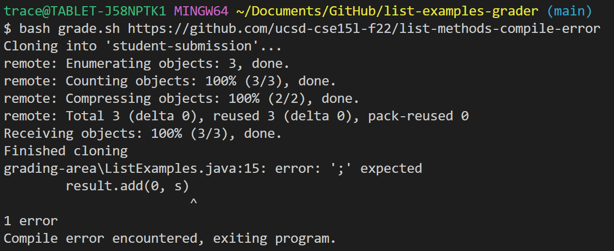
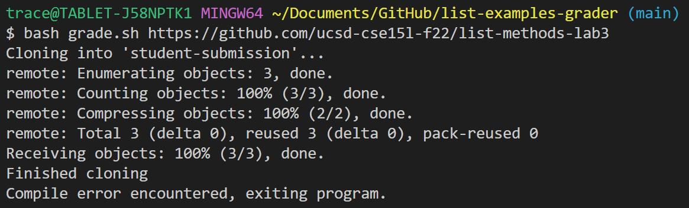

# Lab Report 5

## EDSTEM POST:

### Student:

So, I tried getting the code for the autograde for Lab 6 working, but I'm running into issues with the compile error check. It is properly functioning when the student's code is correct (Screenshot 1) as well as when the student's code has a compile error (Screenshot 2), however, I am running into an issue when the student's code contains errors but not a compile error (Screenshot 3).

Screenshot 1:


Screenshot 2:


Screenshot 3:


Bash Code:
```bash
rm -rf student-submission
rm -rf grading-area

mkdir grading-area

git clone $1 student-submission
echo 'Finished cloning'

#Check that student uploaded correct file
if [[ ! -f ./student-submission/ListExamples.java ]]
then
echo "FileExamples.java does not exist in the repository."
exit
fi

#Copy files to grading area
cp student-submission/ListExamples.java grading-area
cp TestListExamples.java grading-area

#Run tests
javac -cp ".;lib/hamcrest-core-1.3.jar;lib/junit-4.13.2.jar" grading-area/*.java
java -cp ".;./grading-area;lib/hamcrest-core-1.3.jar;lib/junit-4.13.2.jar" org.junit.runner.JUnitCore TestListExamples > testResults.txt

#Check for compile errors
if [[ $? -ne 0 ]]
then
echo "Compile error encountered, exiting program."
exit
fi

# Check if tests were successful
SuccessCheck=`grep "OK" testResults.txt`
# If grep found "OK", all tests passed
# Exit program so failed portion doesn't run
if [[ $? -eq 0 ]]
then
echo "All tests passed."
exit
fi

# Get and print number of run tests and failed tests
runTestsLine=`grep "Tests run:" testResults.txt | grep -oE "Tests run: [0-9]+"`
runTests=$(echo "$runTestsLine" | grep -oE '[0-9]+')
echo "Run tests: $runTests"

failedTestsLine=`grep "Tests run:" testResults.txt | grep -oE "Failures: [0-9]+"`
failedTests=$(echo "$failedTestsLine" | grep -oE '[0-9]+')
echo "Failed tests: $failedTests"
```

Java Code:
```java
import static org.junit.Assert.*;
import org.junit.*;

import java.util.ArrayList;
import java.util.Arrays;
import java.util.List;

class IsMoon implements StringChecker {
  public boolean checkString(String s) {
    return s.toLowerCase().contains("moon");
  }
}

public class TestListExamples {
  @Test(timeout = 500)
  public void testMergeRightEnd() {
    List<String> left = Arrays.asList("a", "b", "c");
    List<String> right = Arrays.asList("a", "d");
    List<String> merged = ListExamples.merge(left, right);
    List<String> expected = Arrays.asList("a", "a", "b", "c", "d");
    assertEquals(expected, merged);
  }

  @Test(timeout = 500)
  public void testFilter() {
    List<String> testList = Arrays.asList("First", "Moon", "Third", "moonshine", "Fourth", "Moonlight", "Fifth", "light the MOON");
    List<String> expectedList = Arrays.asList( "Moon", "moonshine", "Moonlight", "light the MOON");
    assertEquals(expectedList, ListExamples.filter(testList, new IsMoon()));
  }

}
```


### TA:

The `$?` variable holds the error code of the last command run in the script. You could try stepping through each line of code in your script to see where the error code is coming from for your compile error checker.


### Student:

Oops, I realize I was used to java following the javac command on the line after, so I didn't think about the fact the error code being stored in `$?` was the error code being returned by the java command, and not the javac command, so it only knew that an error existed when the code ran, not the compiler. I fixed it by moving the compile error check between the javac and java commands as shown below. Also, here's a screenshot of it working correctly now! Thank you!

Fixed lines:
```bash
#Run tests
javac -cp ".;lib/hamcrest-core-1.3.jar;lib/junit-4.13.2.jar" grading-area/*.java

#Check for compile errors
if [[ $? -ne 0 ]]
then
echo "Compile error encountered, exiting program."
exit
fi

java -cp ".;./grading-area;lib/hamcrest-core-1.3.jar;lib/junit-4.13.2.jar" org.junit.runner.JUnitCore TestListExamples > testResults.txt
```


